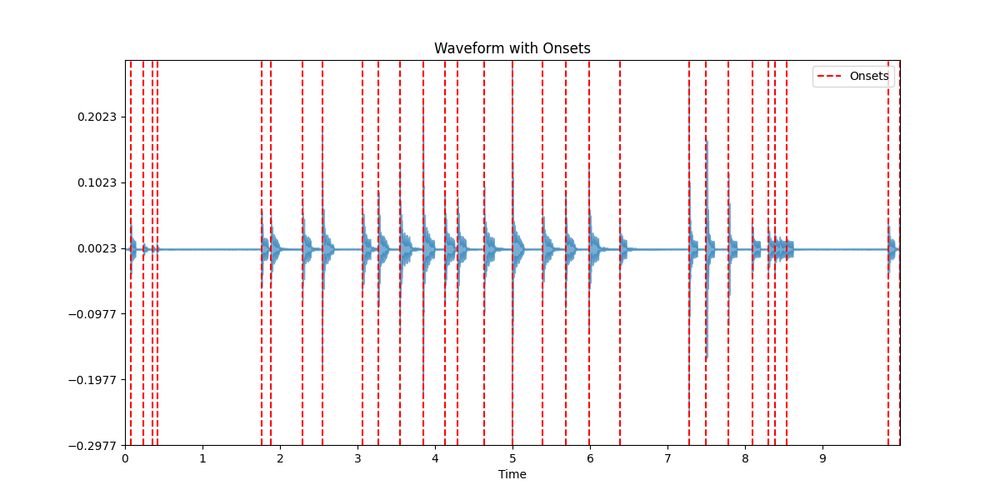

# ett-vid-clipper

This code is used for automatically finding and extracting clips of [Eleven Table Tennis (ETT)](https://elevenvr.com/en/) points from a recording. Clips are extracted in a lossless manner using ffmpeg. It works by detecting paddle hit sounds and grouping sounds that are close together into a "point".

You can see example output in `data/wlad_vs_natping_output.mp4`, which was created by running `python clipper.py data/wlad_vs_natping.mp4 --outclips`. In this case, the script is removing all down-time where action does not occur (about 35% of the video).

**This will not work well for videos with commentary or mic audio**. The model has not been trained on videos commentary and thus will not be able to detect sounds properly.

## Overview

You might use this script in a number ways, such as creating a video that removes all down-time from a recording. By default, it will find the points in the match and print their beginning and ending time points. This list can be saved to a csv file.

Optionally, you can have it create video clips of points for you. It will produce individual clips of every point, as well as a single video file containing all clips.

You might use this script to automatically filter out the non-action times from the entire recording. Or, you might use this script to find the top 10 clips from a match and automatically produce a video containing only those points.

Overall, this should run pretty fast on modest hardware. For instance, I ran this on a 1.5 hour match with over 350 total points. It analyzed the video, produced an mp4 of every clip, and produced an mp4 of all the clips combined in less than 5 minutes total. It turned a 1.5 hour video into a 39 minute video of pure action.

There are a number of options you can use to affect the behavior discussed below.

## Installation

### Python Dependencies

Install Python 3 first.

Install the required Python packages using pip:

(On Windows, you can double click "install_dependencies.bat" to do this automatically.)

```bash
pip install uv
uv pip install -r requirements.txt
```

### System Dependencies

You also need to install ffmpeg, which is used for video processing:

**Windows:**

Press "Win + R". Run "winget install ffmpeg".

**macOS:**

```bash
brew install ffmpeg
```

**Ubuntu/Debian:**

```bash
sudo apt install ffmpeg
```

**Other Linux distributions:**
Install ffmpeg using your distribution's package manager.

## How to use it

### Web Interface (Recommended)

The easisest way to use this is to use the Web Interface:

(On Windows, you can double click "run_webui.bat" to do this automatically.)

```bash
uv run webui.py
```

This should launch the WebUI in your browser automatically. If not, open your browser and go to `http://localhost:7860`.

### Command Line Interface

To get help and see a description of the commands, run:

```bash
uv run clipper.py -h
```

To create a full video of all points without the dead time in-between points, run:

```bash
uv run clipper.py <video-file> --outclips
```

To get a list of the top-10 points (by number of shots) and produce video clips of them, run:

```bash
uv run clipper.py <video-file> --outclips --nclips 10 --orderby shots --reverse-clips
```

The `reverse-clips` option will reverse the order of clips in the full clip video. So, for instance, you will see the longest duration (best clip) last rather than first.

Other options to consider:

- Use `--starttime <x>` to specify that you only want to gather clips after x seconds. For instance, you probably don't want to include any warmup before a match.
- If things are not working well, try tweaking the `--delta` options. These affect the sound detection aspect.

## Inconsistent Version Error

If you get an error like:

> InconsistentVersionWarning: Trying to unpickle estimator DecisionTreeClassifier from version 1.6.1 when using version 1.3.2.

then you can rerun the training yourself to produce an updated `model.pkl` file. To do that, just run `python train.py`, it might take a few minutes.

## How it Works

This script finds clips based on the sound of a ball hitting a paddle. It uses [onset detection](librosa.onset.onset_detect), to determine potential paddle hits, and then a model to classify the sounds as paddle hits or not. For example, if you look at a clip of the audio, you might detect onsets like the following and then classify each of these as a paddle hit or not.



Due to memory constraints, this process needed to be performed in chunks.

Once timestamps are collected for every paddle hit, groups are determined based on gaps between the timestamps; i.e., sounds close together are part of the same point.

Then, ffmpeg is used to clip the time points from the main video file. This process is very fast assuming you do not re-encode the video. Unfortunately, if your timestamp falls on a P-frame (predicted frame, not a keyframe) you must re-encode the video else the video will not display properly. To prevent, this, we find all the keyframes of the video and sync the starting timestamp of our cuts to the keyframe. **If the video has sparse keyframes, this method would be problematic.**

### Model Training

The training data is located in the `data` folder. There are two scripts to create the model, which ultimately is saved at `model.pkl`. The `onsets.py` file creates .wav sound files for all the onsets detected and saved in `data/onsets` and `data/onsets/extended`.

You must move the extended onsets sound files are placed into the `data/training` folder if they are used to train the model. The reason for the extended files is that we use training augmentation create slight perturbations to the starting point of the sound wave to classify, which makes the model more robust. Any sound file used in training must be manually classified as a paddle hit or not in `data/labels.csv`.

Next, you run `train.py` to train the model, which will produce the `model.pkl` file used by `clipper.py`.

## Other notes

- Re-encoding the video kills the runtime. This is why we find the nearest keyframe to the starting timestamp of a clip. Generating video clips is free if you don't have to re-encode, but that requires having enough keyframes to where you don't need to do it. AI led me astray trying to re-encode small pieces and stitch them together, but that route never panned out :). I think it's basically re-encode everything or nothing, and everything will be painful.
